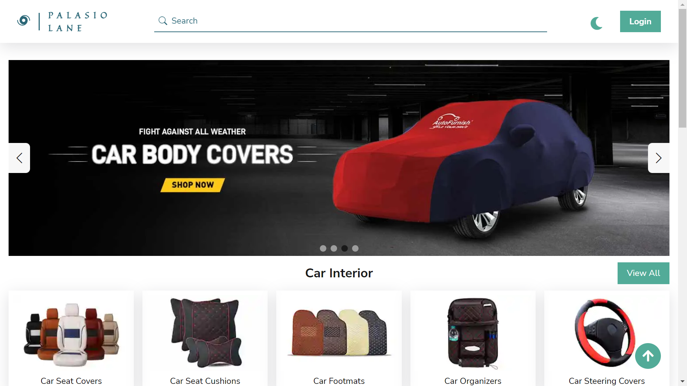
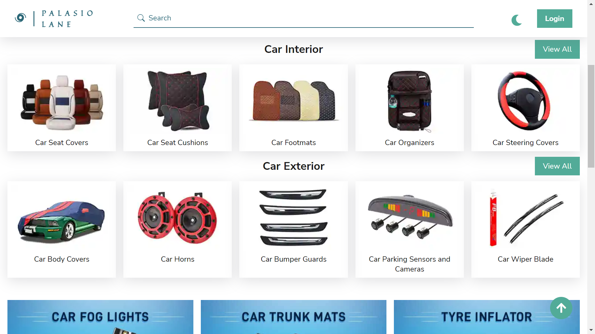
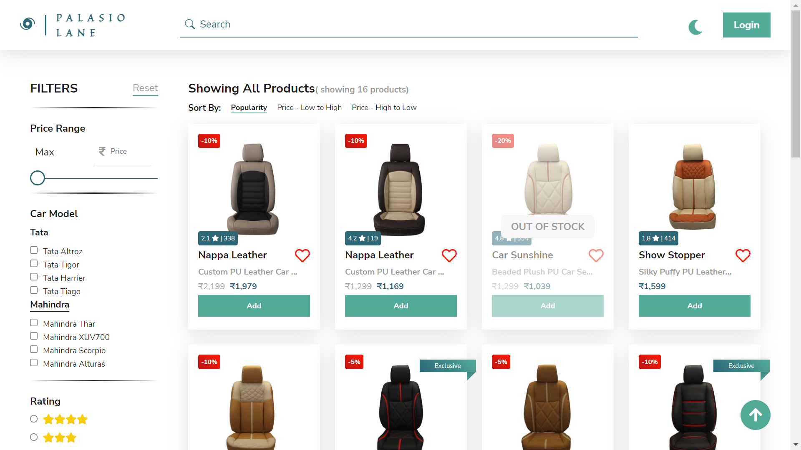
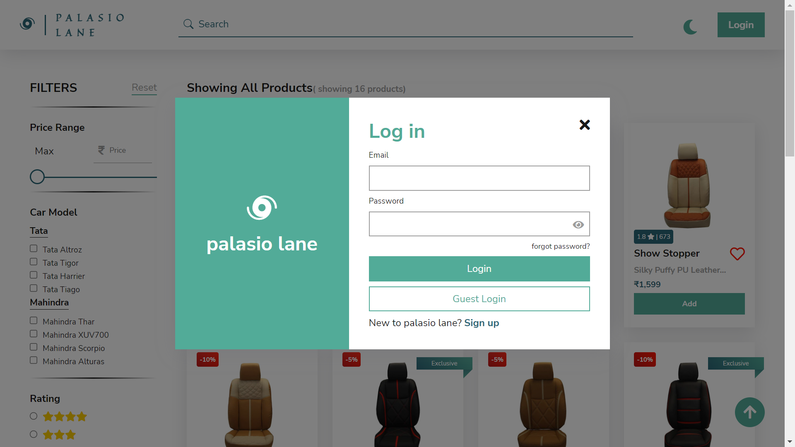
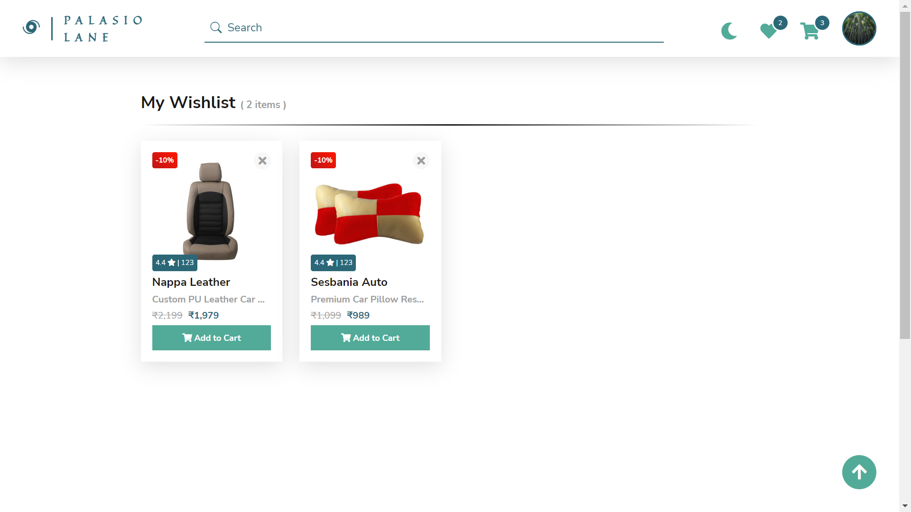
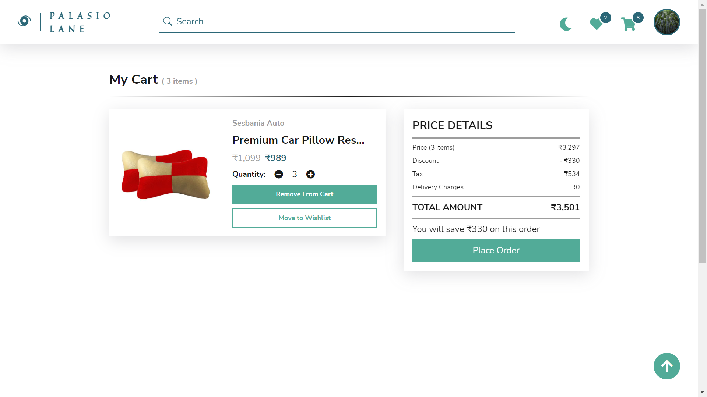
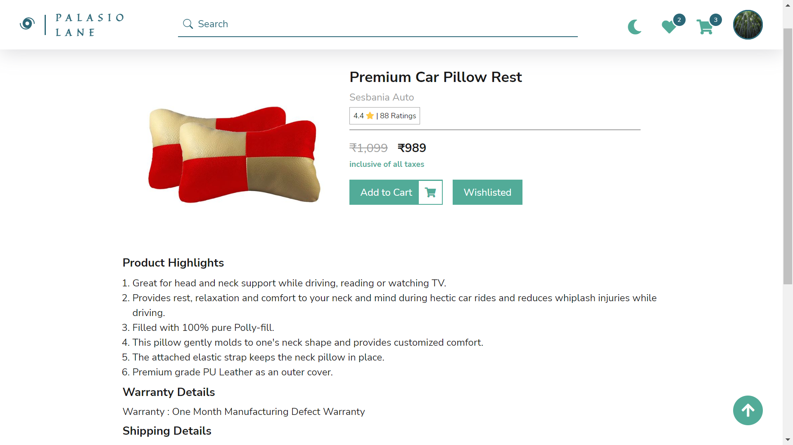

# Palasio Lane

Shop online for a wide range of Car Decor Accessories with Palasio Lane!

---

## Tech Stack

**Client:** React, React Router

**Server:** Node, Express, MongoDB, Mongoose, Nodemailer

**Authentication:** JWT, Password Encryption with Bcrypt

## Functionalities

- Cart
- Wishlist
- Product Detail Page
- Filter and Sort
- Responsive Design
- Loader, Toast
- Search
- Checkout Page
- Apply Coupons
- Razorpay Payment Integration
- Orders Page and Orders Summary
- Forgot Password
- Inventory Management
- Profile Page
- Delete Account
- Dark Mode

## Screenshots

## 🌐 Demo

Have a look at the live demo of [Palasio Lane](https://palasio-lane-store.netlify.app/).

## 🚀 About Me

I'm a full stack developer (MERN). I have always been fascinated by technologies and how they have made our lives better. So learning and exploring new things have always made me happier.

## 🔗 Links

---